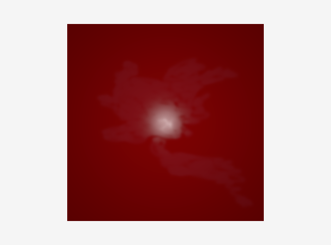

# Lśnienie (specular)


W tym ćwiczeniu zaimplemenentujemy trzeci człon oświetlenia z modelu Phonga, a  mianowicie _lśnienie_ (specular highlights).  Punktem wyjścia będzie oczywiście poprzednie ćwiczenie z oświetleniem dyfuzyjnym.  

## Poprawka oświetlenia dyfuzyjnego

Zaczniemy od poprawienia kodu oświetlenie dyfuzyjnego. Jeżeli Państwo tego jeszcze nie zrobili to należy dodać  człon 1/pi do BRDF-a. W tym celu deklarujemy zmienna
```c
float M_PI = 3.1415926; 
```

A następnie po wczytaniu `diffuse_color` dzielimy  wartości kanałów RGB przez pi:
```c
diffuse_color.rgb/=M_PI;
```

## Obliczenia oświetlenia

Większość pracy została już wykonana: wszystkie potrzebne wielkości znajdują się już w shaderze fragmentów. Pozostało tylko  przesłanie dodatkowych własności materiału do szadera  oraz zaimplementowanie  części specular.  


### Własności materiału

Do obliczeń potrzebujemy dwu dodatkowych własności materiału: koloru lśnienia oraz parametru który determinuję siłe i rozmiar odblasków nazywanym często _shininess_ lub _specular exponent_. Na początek ustawimy te wielkości "na sztywno" w shaderze. W tym celu przed funkcją `main` szadera fragmentów dodajemy deklaracje
```c
vec3 specular_color = vec3(1.0, 1.0, 1.0);
float shininess = 500.0; 
```

### Człon lśnienia

Do obliczenia oświetlenia użyjemy modelu Blinna-Phonga. Przypominam, że w tym modelu siła światła odbitego jest dana wzorem: 


gdzie *c_spec*  to kolor lśnienia, a _m_ to shininess.
Z pozostałych wielkości nie mamy tylko "półwektora" H zdefiniowanego jako 


Wektor V to tzw. "view vector"  czyli  znormalizowany(o długości jeden) wektor w kierunku do oka/kamery. Żeby go obliczyć potrzebujemy więc położenia kamery. Ale działamy w przestrzeni kamery (view space) więc z definicji położenie kamery to (0,0,0). 

Proszę w fukcji `main` shadera fragmentów dodać odpowiedni kod
```c
vec3 view_vector = 
```
a nastepnie obliczyć pół-wektor
```c
vec3 half_vector = 
```

Następnie  proszę wyliczyć natężenie  lśnienia
```c
float specular =  
```
ze wzoru 


przy czym należy pamiętać, że jeśli wartość iloczynu skalarnego H i N jest mniejsza od zera to ustawiamy ją na zero, co może być łatwo zaimplemntowane za pomocą funkcji `max`. Do podniesienia do potęgi służy funkcja `pow`. 

Teraz możemy już dodać człon lśnienia do koloru piksela
```c
vFragColor.rgb += light_in*light.color*specular; 
```

Jeśli wszystko poszło dobrze to powinni Państwo zobaczyć taki obrazek:


## Refactoryzacja

Przed pójściem dalej dokonamy drobnej refaktoryzacji, żeby trochę uporządkować kod w metodzie `init` klasy `SimpleShapeApplication`. 

W pliku `src/Application/utils.h` w przestrzeni nazw `xe::utils` dodamy deklaracje dwu pomocniczych funkcji
```c++
void set_uniform1i(GLuint program, const std::string& name, int value);
void set_uniform_block_binding(GLuint program, const std::string &name, GLuint binding);
```

i odpowiadające im definicje w pliku `src/Application/utils.cpp`
```c++
void set_uniform1i(GLuint program, const std::string &name, int value) {
    auto location = glGetUniformLocation(program, name.c_str());
    if (location == -1) {
            std::cerr << "Cannot find uniform `" << name << "'" << std::endl;
    } else {
            glUniform1i(location, value);
    }
}
        
void set_uniform_block_binding(GLuint program, const std::string &name, GLuint binding) {
    auto block_index = glGetUniformBlockIndex(program, name.c_str());
    if (block_index == GL_INVALID_INDEX) {
        std::cout << "Cannot find `" << name << "' in program " << program << std::endl;
    } else {
    glUniformBlockBinding(program, block_index, binding);
    }
}        
```
Proszę ich użyć do zastąpienia odpowiednich fragmentów kodu w metodzie `init`. 


Zmodyfikujemy też trochę blok świateł, tak aby było łatwiej go przesyłąc. W tym celu zmieniamy deklarację struktury `Light` na 
```c++
struct Light {
    glm::vec4 position;
    glm::vec4 position_in_vs;
    glm::vec4 color;
    glm::vec4 a;
    glm::vec4 ambient;
};
```
i odpowiednio w szaderze fragmentów:
```c
layout(std140) uniform Light {
    vec3 position_in_vs;
    vec3 color;
    vec3 a;
    vec3 ambient;
} light;
```
 W metodzie frame przesłanie danych oświetlenia może teraz zostać wykonane jednym poleceniem `glBufferSubdata`:
```c++
light_.position_in_vs = camera()->view() * light_.position;
glBindBuffer(GL_UNIFORM_BUFFER, u_buffer_handle_[1]);
glBufferSubData(GL_UNIFORM_BUFFER, 0, 16 * sizeof(float), &light_.position_in_vs[0]);
glBindBuffer(GL_UNIFORM_BUFFER, 0);
```

## Materiał 

Oczywiście "zaszycie" na stałe własności materiału w szaderze fragmentów jest nieakceptowalne.   W tej części ćwiczenia zajmiemy się poprawieniem tego.  Zaczniemy od zdefiniowania nowej klasu `PhongMaterial` w pliku `phong_material.h`
```c++
struct PhongMaterial {
    alignas(16) glm::vec3 Kd;
    alignas(4) uint32_t Kd_map;
    alignas(16) glm::vec3 Ks;
    alignas(4) uint32_t Ks_map;
    alignas(4) float Ns;
    alignas(4) uint32_t Ns_map;
};
```
Pola `Kd`, `Ks` i `Ns` odpowiadają kolejno kolorowi dyfuzyjnemu (albedo) i lśnienia oraz shininess. Każdy z nich może też być wczytywany z tekstury których nazwy, w sensie nazw OpenGL-a, przechowywane są w polach `*_map`.  Wartość zero oznacza   brak tekstury. Struktura jest tak przygotowana, żeby było ją można przesłać do szadera fragmentów jednym poleceniem. Wprawdzie nazwy tekstur są w szaderze  bezużyteczne, ale wykorzystamy je do przekazania informacji  czy własności mają być pobierane z tekstury czy nie. 

W klasie `Quad` dodajemy więc pole
```c
PhongMaterial *material_;
```
i  odpowiadające mu gettery i settery.  

W metodzie `init` tworzymy nowy materiał poleceniem `new` i przypisujemy własności np.
```c
material->Kd = glm::vec3(1.0, 0.0, 0.0);
material->Kd_map = 0;
material->Ks = glm::vec3(0.05, 0.05, 0.05);
material->Ks_map = 0;
material->Ns = 1000.0f;
material->Ns_map = 0;
```
ważne jest aby wszystkim teksturą przypisać wartość zero. Następnie dodajemy materiał do naszego quada:
```c++
quad_->set_material(material);
```
gdzie `set_material` to odpowiedni setter który zdefiniowaliśmy wcześniej.

W shaderze fragmentów tworzymy odpowiadający  tej strukturze blok interfejsu:
```c
layout(std140) uniform Material {
    vec3 Kd;
    uint Kd_map;
    vec3 Ks;
    uint Ks_map;
    float Ns;
    uint Ns_map;
} material;
```
W metodzie `init` wykonujemy standardowe operacje: 
1. Przypisujemy temu blokowi indeks. 
1. Tworzymy nowy  bufor uniform
1. Podczepiamy ten bufor pod przypisany wcześniej indeks. 

W metodzie `frame` wysyłamy własności materiału do shadera poleceniem
```c
glBufferSubData(GL_UNIFORM_BUFFER, 0, sizeof(PhongMaterial), quad_->material());
```
Oczywiście wcześniej musimy zbindować odpwiedni bufor. 
Metoda `material` w klasie `Quad` to zdefiniowany wcześniej getter który zwraca wskaźnik do materiału. 

Teraz w shaderze fragmentów powinniśmy mieć już potrzebne własności materiału. Jeżeli dana własność ma być dodawana z tekstury to jej wartość jest iloczynem wartości pobranej z tekstury i wartości odpowiadającego jej parametru:
```c
vec4 diffuse_color;

if (material.Kd_map>0) {
    diffuse_color.a = texture(diffuse_map, vertex_tex_coord).a;
    diffuse_color.rgb = texture(diffuse_map, vertex_tex_coord).rgb*material.Kd;
} else {
    diffuse_color.a = 1;
    diffuse_color.rgb = material.Kd;
}
```
i podobnie dla pozostałych
```c
vec3 specular_color;
if (material.Ks_map>0) {
    specular_color = texture(specular_map, vertex_tex_coord).rgb*material.Ks;
} else {
    specular_color = material.Ks;
}

float shininess;
if (material.Ns_map>0) {
    shininess = texture(shininess_map, vertex_tex_coord).r*material.Ns;
} else {
    shininess = material.Ns;
}
```
Przy czym wcześniej musimy  zadeklarować dwie dodatkowe zmienne typu `sampler2D`:
```c
uniform sampler2D specular_map;
uniform sampler2D shininess_map;
```

Proszę zwrócić uwagę, że tekstura zawierająca shininess ma jeden kanał. Moglibyśmy ten kanał upchnąć jako czwarty kanał (alpha) tesktury `Ks_map`, ale zdecydowałem się na ich rozdzielenie ze względu na trudności z zapisem kanału alpha w pliku PNG w programie Photoshop :(


### Tekstury 

Teraz czas na załadowanie tekstur. W tym celu musimy przenieść kod za to odpowiedzialny z klasy `Quad` do metody `init` w klasie `SimpleShapeApplication`. 
W tym celu  generujemy nową teksturę: 
```c++
GLuint diffuse_texture;
glGenTextures(1, &diffuse_texture);
glActiveTexture(GL_TEXTURE0);
```
i następnie kopiujemy i odpowiednio modyfikujemy kod ładujący teskturę z konstruktora klasy `Quad`. Wymaga to odrobiny zachodu  zwiazanego z kompilacją biblioteki `stb_image`. Ta biblioteka jest całkowicie zawarta w plikach "*.h". W celu  jej użycia musimy _dokładnie_ w jednym z plików  zdefiniować macro:
```c++
#define STB_IMAGE_IMPLEMENTATION
```
zanim zainkludujemy plik `stb_image.h`
```c++
#include "3rdParty/src/stb/stb_image.h"
```
Żeby nie musieć o tym myśleć proszę stworzyć w kartotece `src/Application` plik `stb_image.cpp` zawierający jedynie dwie linijki:
```c++
#define STB_IMAGE_IMPLEMENTATION
#include "3rdParty/src/stb/stb_image.h"
```
a następnie  dodać ten plik do kopilacji poprzez  plik `CMakeLists.txt` w kartotece `src/Application`. W ten sposób wystarczy w pozostałych plikach  gdzie potrzebujemy użyć tej biblioteki wyłącznie inkludować plik `stb_image.h`. 

Jeśli wszystko nam się kompiluje to ładujemy teksturę z pliku `plastic.png` (uwaga, zawiera tylko trzy kanały) i dodajemy ją do materiału:
```c++
material->Kd = glm::vec3(1.0, 1.0, 1.0);
material->Kd_map = diffuse_texture;
```

Teraz wyrzucamy wszystkie polecenia  związane z teksturą z klasy `Quad`, zarówno z kosntruktora jak i metody `frame`. 

Pozostaje na tylko dodać do metody `frame` kod podłaczający tekturę. 
```c++
auto material = quad_->material();
if(material->Kd_map>0) {
    glActiveTexture(GL_TEXTURE0);
    glBindTexture(GL_TEXTURE_2D, material->Kd_map);
}
```

### Kolejna refaktoryzacja

Zanim załadujemy kolejną teksturę wyodrębnimy  użyty do tego kod do  osobnej w fukcji. W tym celu w pliku `src/Application/utils.cpp` w przestrzeni nazw `xe::utils` proszę dodać funkcje
```c++


td::string error_msg(GLenum status) {
switch (status) {
    case GL_INVALID_ENUM:
        return "INVALID ENUM";
    case GL_INVALID_VALUE:
        return "INVALID VALUE";
    case GL_INVALID_OPERATION:
        return "INVALID OPERATION";
    case GL_STACK_OVERFLOW:
        return "STACK OVERFLOW";
    case GL_STACK_UNDERFLOW:
        return "STACK UNDERFLOW";
    case GL_OUT_OF_MEMORY:
        return "OUT OF MEMORY";
    case GL_INVALID_FRAMEBUFFER_OPERATION:
        return "INVALID FRAMEBUFFER OPERATION";
    default:
        return "UNKNOWN ERROR";
    }
}

uint8_t *load_image(const std::string &filename, int *width, int *height, int *n_channels) {
stbi_set_flip_vertically_on_load(true);
auto data = stbi_load(filename.c_str(), width, height, n_channels, 0);
if (data == nullptr) {
    std::cerr << "cannot load image from file `" << filename << "'\n";
    } else {
        std::cout << "read " << *width << "x" << *height << "x" << *n_channels << " image from file "
              << filename
              << "\n";
            }
return data;
}

void load_texture(const std::string &filename) {
    int width, height, n_channels;
    auto data = xe::utils::load_image(filename, &width, &height, &n_channels);
    if (data) {
        if (n_channels == 3)
            glTexImage2D(GL_TEXTURE_2D, 0, GL_SRGB, width, height, 0, GL_RGB, GL_UNSIGNED_BYTE, data);
        else if (n_channels == 4)
            glTexImage2D(GL_TEXTURE_2D, 0, GL_SRGB_ALPHA, width, height, 0, GL_RGB, GL_UNSIGNED_BYTE, data);
        else if (n_channels == 2)
            glTexImage2D(GL_TEXTURE_2D, 0, GL_RG, width, height, 0, GL_RG, GL_UNSIGNED_BYTE, data);
        else if (n_channels == 1)
            glTexImage2D(GL_TEXTURE_2D, 0, GL_RED, width, height, 0, GL_RED, GL_UNSIGNED_BYTE, data);
        else {
            std::cerr << "Unsuported number of chanels ( " << n_channels << ")  in texture \n";
        }
        auto status = glGetError();
        if (status != GL_NO_ERROR) {
            std::cerr << "Error " << status << " " << xe::utils::error_msg(status)
                      << " while loading a texture "
                      << std::endl;
        }
        glTexParameteri(GL_TEXTURE_2D, GL_TEXTURE_MAG_FILTER, GL_NEAREST);
        glTexParameteri(GL_TEXTURE_2D, GL_TEXTURE_MIN_FILTER, GL_NEAREST);
    }
    stbi_image_free(data);
}
```
i odpowiadające im wpisy w  pliku nagłówkowym `utils.h`. Teraz możemy kod w metodzie `init` skrócić do 
```c++
glGenTextures(1,&diffuse_texture);
glActiveTexture(GL_TEXTURE0);
glBindTexture(GL_TEXTURE_2D, diffuse_texture);
xe::utils::load_texture(std::string(PROJECT_DIR) + "/Textures/plastic.png");
glBindTexture(GL_TEXTURE_2D, 0);
```


### Pozostałe tekstury. 

Żeby móc skorzystać z  kolejnych tekstur musimy przypisać im odpowiednie jednostki teksturujące poleceniami:
```c++
xe::utils::set_uniform1i(program,"specular_map",1);
xe::utils::set_uniform1i(program,"shininess_map",2);
```
a w metodzie `frame` dodać:
```c++
if(material->Ks_map>0) {
    glActiveTexture(GL_TEXTURE1);
    glBindTexture(GL_TEXTURE_2D, material->Ks_map);
}
if(material->Ns_map>0) {
    glActiveTexture(GL_TEXTURE2);
    glBindTexture(GL_TEXTURE_2D, material->Ns_map);
}
```

Teraz proszę załadować do `shininess_map` teksturę z pliku `shininess.png` i przypisać ją do materiału:
```c++
material->Ns = 1000.0f;
material->Ns_map = shininess_texture;
```
Jeśli wszystko poszło dobrze powinni Państwo zobaczyć taki obraz:


